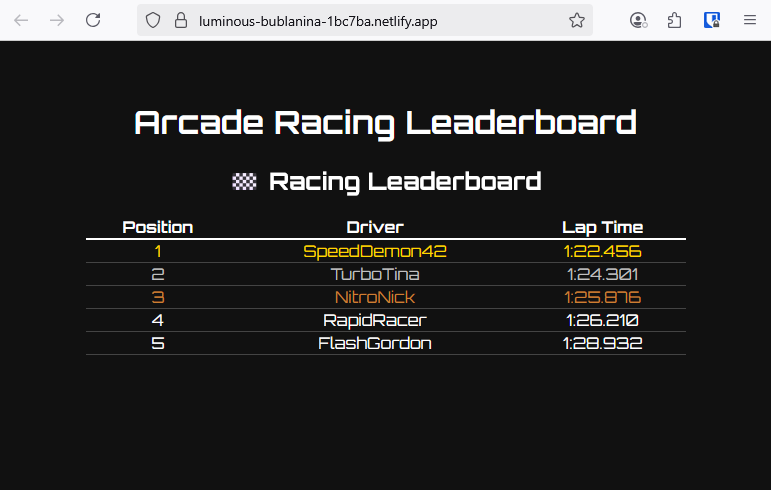

# 🏁 Racing Leaderboard

A fast, arcade-style racing leaderboard built with **Astro** and **React**, styled for a racing sim arcade.  
Animated with **Framer Motion** and powered by a JSON data source.

## 🚀 Live Demo
- **Netlify:** [https://luminous-bublanina-1bc7ba.netlify.app](https://luminous-bublanina-1bc7ba.netlify.app)



## ✨ Features
- Astro static site + partial hydration for React component
- JSON-powered leaderboard
- Animated row entries with Framer Motion
- Gold/Silver/Bronze highlighting for top 3 racers
- Fully responsive and fast-loading

## 🛠 Tech Stack
- **Astro** (Static site generation)
- **React** (Leaderboard component)
- **Framer Motion** (Animations)
- **JSON** (Public data source)
- Hosted on **Vercel** and **Netlify**

## 📂 Project Structure
```text
/
├── public/           # Public assets (including laptimes.json)
├── src/
│   ├── components/   # React components
│   │   └── Leaderboard.jsx
│   ├── pages/
│   │   └── index.astro
└── package.json

🧞 Commands
Command	Action
npm install	Install dependencies
npm run dev	Start local dev server at localhost:4321
npm run build	Build for production to ./dist/
npm run preview	Preview the production build locally
📜 License

MIT License

